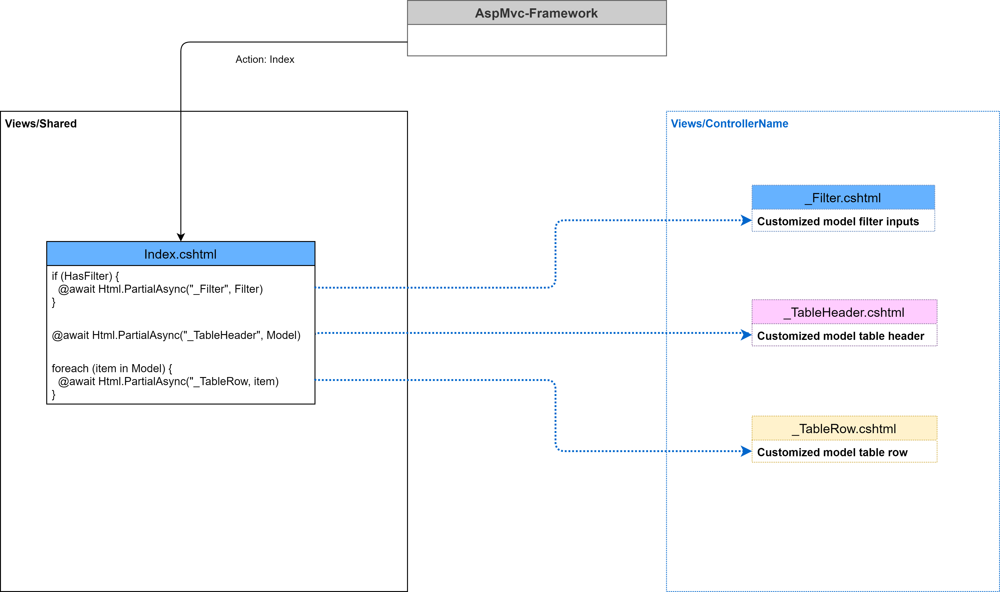

# Vordefinierte AspMvc-Views

## Default Index View

Die Index-View im Bereich *'Views/Shared'* ist eine Standard-View fuer die Uebersichts-Seite von Modellen. Diese Ansicht unterstützt 3 Arten von Teil-Ansichten welche fuer das entsprechende Model angepasst werden muessen. Die Teil-Ansicht *'_Filter.cshtml'* ist optional und muss im nicht bereit gestellt werden. Die anderen beiden Teil-Ansichten *'_TableHeader.cshtml'* und *'_TableRow.cshtml'* muessen hingegen im konkreten *'Views/ControllerName'* bereit gestellt werden. In der nachfolgenden Skizze ist der Aufbau schematisch skizziert:  

  

### Ein Beispiel fuer die Verwendung der Default Index Ansicht

Im folgenden wird die Verwendung der Standard Index Ansicht fuer das Model *'Person'* mit Filter demonstriert.

#### Das Model *'Person'*  

```csharp  
public class Person : IdentityModel
{
    public string? Firstname { get; set; };
    public string? Lastname { get; set; };
}
```  

#### Das Model *'FilterModel'*

```csharp  
public class PersonFilter
{
    public bool HasValue => string.IsNullOrEmpty(Name) == false || string.IsNullOrEmpty(ShortDescription) == false || string.IsNullOrEmpty(LongDescription) == false || State.HasValue;
    public string? Firstname { get; set; }
    public string? Lastname { get; set; }

    public override string ToString()
    {
        return $"Firstname: {(string.IsNullOrEmpty(Firstname) == false ? Firstname : "---")} Lastname: {(string.IsNullOrEmpty(Lastname) == false ? Lastname : "---")}";
    }
}
```  

#### Erweiterung des Kontrollers *'PersonController'* fuer die Filter-Funktion

```csharp  
public class PersonController : GenericController<Entities.Person, Models.Person>
{
    private static string FilterName => typeof(PersonFilter).Name;
    public PersonController(Logic.IDataAccess<Entities.Person> dataAccess) : base(dataAccess)
    {
    }

    public override async Task<IActionResult> Index()
    {
        IActionResult? result;
        var filter = SessionWrapper.Get<PersonFilter>(FilterName) ?? new PersonFilter();

        if (filter.HasValue)
        {
            var instanceDataAccess = DataAccess as Logic.Controllers.PersonController;
            var accessModels = await instanceDataAccess!.QueryByAsync(filter.Firstname, filter.Lastname);

            result = View(AfterQuery(accessModels).Select(e => ToViewModel(e, ActionMode.Index)));
        }
        else
        {
            var accessModels = await DataAccess.GetAllAsync();

            result = View(AfterQuery(accessModels).Select(e => ToViewModel(e, ActionMode.Index)));
        }

        ViewBag.Filter = filter;
        return result;
    }

    public async Task<IActionResult> Filter(PersonFilter filter)
    {
        IActionResult? result;

        if (filter.HasValue)
        {
            var instanceDataAccess = DataAccess as Logic.Controllers.PersonController;
            var accessModels = await instanceDataAccess!.QueryByAsync(filter.Firstname, filter.Lastname);

            result = View("Index", AfterQuery(accessModels).Select(e => ToViewModel(e, ActionMode.Index)));
        }
        else
        {
            result = RedirectToAction("Index");
        }

        ViewBag.Filter = filter;
        SessionWrapper.Set<PersonFilter>(FilterName, filter);
        return result;
    }
}
```  

#### Die Ansicht *_Filter.cshtml* im Ordner */Views/Person*

```csharp  
@model ...PersonFilter

<div class="row">
    <div class="col-md-4">
        <form asp-action="Filter">
            <div asp-validation-summary="ModelOnly" class="text-danger"></div>
            <div class="form-group">
                <label asp-for="Firstname" class="control-label"></label>
                <input asp-for="Firstname" class="form-control" />
            </div>
            <div class="form-group">
                <label asp-for="Lastname" class="control-label"></label>
                <input asp-for="Lastname" class="form-control" />
            </div>
            <p></p>
            <div class="form-group">
                <input type="submit" value="Apply" class="btn btn-primary" />
            </div>
        </form>
    </div>
</div>
```  

#### Die Ansicht *_TableHeader.cshtml* im Ordner */Views/Person*

```csharp  
@model ...Person

<thead>
    <tr>
        <th>
            @Html.DisplayNameFor(model => model.Firstname)
        </th>
        <th>
            @Html.DisplayNameFor(model => model.Lastname)
        </th>
        <th></th>
    </tr>
</thead>
```  

#### Die Ansicht *_TableRow.cshtml* im Ordner */Views/Person*

```csharp  
@model ...Person

<tr>
    <td>
        @Html.DisplayFor(model => model.Firstname)
    </td>
    <td>
        @Html.DisplayFor(model => model.Lastname)
    </td>
    <td>
        @Html.ActionLink("Edit", "Edit", new { id=Model.Id }) |
        @Html.ActionLink("Details", "Details", new { id=Model.Id }) |
        @Html.ActionLink("Delete", "Delete", new { id=Model.Id })
    </td>
</tr>
```  

Nun kann die Standard Index Ansicht mit Filter verwendet werden.

## Default Create View  

  

### Die Ansicht *_EditModel* im Ordner */Views/Person*

```csharp  
@model ...Person

<div class="row">
    <div class="col-md-4">
        <div asp-validation-summary="ModelOnly" class="text-danger"></div>
        <div class="form-group">
            <label asp-for="Firstname" class="control-label"></label>
            <input asp-for="Firstname" class="form-control" />
            <span asp-validation-for="Name" class="text-danger"></span>
        </div>
        <div class="form-group">
            <label asp-for="Lastname" class="control-label"></label>
            <input asp-for="Lastname" class="form-control" readonly="readonly" />
            <span asp-validation-for="Name" class="text-danger"></span>
        </div>
    </div>
</div>
```  

## Default Edit View

  

### Die Ansicht *_EditModel* im Ordner */Views/Person*  

```csharp  
@model ...Person

<div class="row">
    <div class="col-md-4">
        <div asp-validation-summary="ModelOnly" class="text-danger"></div>
        <div class="form-group">
            <label asp-for="Firstname" class="control-label"></label>
            <input asp-for="Firstname" class="form-control" />
            <span asp-validation-for="Name" class="text-danger"></span>
        </div>
        <div class="form-group">
            <label asp-for="Lastname" class="control-label"></label>
            <input asp-for="Lastname" class="form-control" readonly="readonly" />
            <span asp-validation-for="Name" class="text-danger"></span>
        </div>
    </div>
</div>
```  

## Default Delete View

  

### Die Ansicht *_DisplayModel* im Ordner */Views/Person*  

```csharp  
@model ...Person

<dl class="row">
    <dt class="col-sm-2">
        @Html.DisplayNameFor(model => model.Firstname)
    </dt>
    <dd class="col-sm-10">
        @Html.DisplayFor(model => model.Firstname)
    </dd>
    <dt class="col-sm-2">
        @Html.DisplayNameFor(model => model.Lastname)
    </dt>
    <dd class="col-sm-10">
        @Html.DisplayFor(model => model.Lastname)
    </dd>
</dl>
```  

## Default Details View

  

### Die Ansicht *_DisplayModel* im Ordner */Views/Person*  

```csharp  
@model ...Person

<dl class="row">
    <dt class="col-sm-2">
        @Html.DisplayNameFor(model => model.Firstname)
    </dt>
    <dd class="col-sm-10">
        @Html.DisplayFor(model => model.Firstname)
    </dd>
    <dt class="col-sm-2">
        @Html.DisplayNameFor(model => model.Lastname)
    </dt>
    <dd class="col-sm-10">
        @Html.DisplayFor(model => model.Lastname)
    </dd>
</dl>
```  


*Viel Erfolg beim Anwenden!*